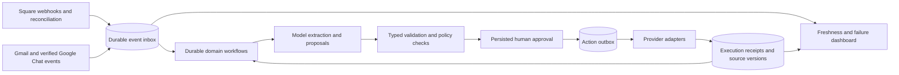

# Reliable syncing and agent execution

Owner: Winefornia / Innovatus. Audit date: 2026-09-14.

## What actually failed

- GitHub's Square Sync remained active, but all nine scheduled runs from July 19
  through September 13 failed before executing the sync. `SQUARE_PROD_ACCESS_TOKEN`
  and `SUPABASE_SERVICE_KEY` were never configured in Actions. The July 19 and
  September 13 logs show the same missing-secret error. A green deployment was
  therefore not evidence of working synchronization.
- The repository is public. GitHub can disable scheduled workflows after 60 days
  of inactivity; schedules also run only from the default branch and can be
  delayed. A branch push alone does not install a scheduler fix on `main`.
- A live metadata audit of Supabase project `zlbixpklvejcuxifqzjk` found
  `public.invoice_chat_turns` with RLS disabled. The other 26 public tables had
  RLS, but all 27 retained client-role grants. No client-readable public views or
  foreign tables were found by this audit. This is an exposure finding, not
  evidence that anyone accessed or changed the data.
- `db/schema.sql` created `invoice_chat_turns` without enabling RLS. Its previous
  RLS list was incomplete, and deploys do not apply SQL migrations.
- Sync checkpoints used completion time, potentially skipping records changed
  after an early page was fetched. Customer tier preservation relied on one
  capped Supabase response and a stale read/write cycle. Invoice amounts preferred
  money paid over computed total due. Customer mappings stopped at 1,000 rows.
- The registry's `square_lookup_customer` called a create-capable function.
  Returned errors and explicit `ToolError`s could produce `has_error=false` traces.
- The open historical test issue #3 is not reproducible in the current checkout:
  the baseline suite passed, including Gmail auth and activity tests.

Evidence: [first failed sync](https://github.com/winefornia/innovatus-agent/actions/runs/29683120296),
[latest scheduled failure](https://github.com/winefornia/innovatus-agent/actions/runs/34760085919),
[security audit](https://github.com/winefornia/innovatus-agent/actions/runs/34817325558),
[committed security repair](https://github.com/winefornia/innovatus-agent/actions/runs/34817481308).

## Immediate repair

The maintenance workflow uses the existing `FLY_API_TOKEN` to execute reviewed
code in a running `winefornia-agent` web Machine. Square and Supabase service keys
stay in Fly. No service keys need to be copied into this public repository or
into additional GitHub secrets. Temporary maintenance scripts are removed after
execution; they do not replace the deployed application image.

`db/migrations/20260914_backend_table_security.sql` enables RLS and revokes
anonymous, authenticated, and PUBLIC table grants for the application's known
backend tables. It does not delete rows or change service-role grants. The repair
checks the project identity, audits metadata, applies changes transactionally,
checks for unresolved exposure and lost backend privileges, commits, then probes
the backend Data API without retrieving records. Unknown exposed tables cause the
transaction to roll back; investigate them instead of silently broadening scope.

The sync now replays ten minutes before the last successful start watermark,
compares actual UTC instants, backfills when there is no checkpoint, preserves
staff-owned tier fields by excluding them from upserts, paginates customer maps,
checks every write acknowledgement, and records success/failure counts and times.
Square reads have bounded SDK retries and timeouts; idempotent Supabase upserts
retry transient transport/server failures only. Business actions are not retried
by this sync code. The source window advances only after the entity succeeds.

Current limits: lists are accumulated per entity in memory; this is not a
page-checkpointed ingestion engine. Counts and acknowledgements do not prove
historical completeness. Repeated full reconciliation is needed until provider
versions, deletes, and per-page checkpoints are supported. Invoice history totals
with no computed amount fall back to completed money and should be treated as
best available historical values, not an accounting ledger.

The weekly GitHub schedule is an interim recovery mechanism. Changing its cron
also reactivates schedule activity, but does **not** remove GitHub's inactivity
policy. Do not claim the long-term scheduler migration is complete.

## Verified recovery results

The full production reconciliation on 2026-09-14 wrote 1,023 customers, 1,213
orders, and 463 invoices in 35 seconds. All three entities completed successfully.
[Full reconciliation run](https://github.com/winefornia/innovatus-agent/actions/runs/34817948207).
The live app returned HTTP 200 with watcher status `ok` after the security repair.
The repair-branch suite passed 438 tests with 3 skipped. These observations verify
the immediate repair; they do not demonstrate long-term scheduling or replay SLOs.

## Target design

Use one durable execution layer for business work, retaining the deterministic
invoice and tasting-room state machines as separate domain workflows. Models
extract facts and propose typed actions; code resolves identity, permissions,
approvals, and transitions. A model response is not proof that an action executed.



Recommended destination: evaluate Temporal for long-running workflows, timers,
activity retries, and versioned recovery. Keep the existing LangGraph logic where
it is useful for reasoning; it must not independently own the same external side
effects. Temporal does not make a remote API call exactly-once. Provider
idempotency, a durable action ledger, and reconciliation remain necessary.

Do a small replay prototype before adding a production Temporal service. If
operational cost is disproportionate at this scale, use a Postgres inbox/outbox
with leased workers and persistent LangGraph checkpoints, accepting ownership of
lease expiry, timers, retries, migration compatibility, and replay tooling.
Do not add another framework just to rename the current background tasks.

## Rollout with measurable gates

| Phase | Concrete work | Exit gate |
| --- | --- | --- |
| 0: recover and contain | Apply RLS migration; verify backend access; merge the repaired workflow; run full Square backfill; verify health | Zero public RLS omissions; no client grants on backend tables; all three sync entities succeed; no customer tiers changed by sync |
| 1: independent scheduling and visibility | Move periodic reconciliation to a durable schedule/leased Fly worker; use an independent monitor outside the worker and GitHub; keep Actions as manual repair tooling | Leave repo inactive in a schedule simulation; kill the worker; monitor reports missing success even if no run ever started; restart catches up without duplicate rows |
| 2: durable ingestion | Store provider event ID, location/account, source version/time, payload hash, received time, processing state and attempts in an inbox; validate webhook signatures; acknowledge only after commit; checkpoint pages and high-water marks; reconcile deletions/merges | Duplicate, reordered and missing webhook tests converge to provider state; a failed page does not advance its checkpoint; 10,000-customer backfill preserves every tier and mapping |
| 3: durable tool execution | Persist action proposals and approvals; create an outbox atomically with the approved transition; dispatch through validated adapters; save provider receipts and explicit outcome states | Kill before/after each provider call; duplicate confirm clicks and expired approvals cannot create extra invoices or emails; uncertain outcomes become reconciliation work |
| 4: operational ownership | Add locked dependencies, staged upgrades, clean-DB migration CI, restart/replay tests, backup restore drills, named operators and scoped machine-exec credentials | Restore into a staging DB and replay pending work; deploy a graph change with old pending cases; operator can diagnose and retry without editing SQL |

Suggested acceptance targets (to validate against provider limits and winery needs):
webhook-to-data visibility under five minutes, reconciliation every six hours,
alert after twelve hours without verified sync success, and security checks on
every migration/deployment plus a daily independent audit. No automatic customer
sends should be introduced by a freshness alert or reconciliation task.

For phase 1, prefer a scheduler that runs in the same operational account as the
app and is independent of repository activity. Keep progress in Postgres and use
a database lease with expiry and an owner/fencing token so Actions, a worker, and
manual recovery cannot race. Do not hold a pooled session advisory lock on
pgBouncer transaction pooling. Record `next_due_at`/last successful source window
in the database; process-local timers alone are not sufficient.

For phase 2, separate Square-owned data from staff-owned tier/pricing fields.
Persist each page before advancing its checkpoint, retain source versions to
reject stale events, and use a bounded overlap plus periodic full reconciliation.
Treat entity failures independently while recording missing customer references
for a later repair pass. Pin adapter versions and contract-test SDK pager shapes
and error envelopes on dependency upgrades.

For phase 3, start with invoice chat: `_PENDING` currently lives only in memory,
and confirmation removes it before executing. Chat handlers also acknowledge and
continue through `asyncio.create_task`, so a restart can lose accepted work. The
legacy LangGraph wizard already requires persistent Postgres in production;
that does not make the conversational path durable. Tasting chat persists a
pending action, but its read/delete/execute sequence is not an atomic claim.

Approval must bind the verified actor, pipeline, case, action ID, canonical
argument hash, expiry, and policy version. Confirm performs an atomic transition
from `pending_approval` to `queued`; the worker claims with a lease/fencing token.
A `requires_approval` metadata flag in the current registry is not enforcement.
Enforce at dispatch using the stored approval, not an LLM-supplied Boolean.

Persist action states `pending_approval`, `queued`, `running`, `succeeded`,
`retryable_failure`, `permanent_failure`, `outcome_unknown`, `cancelled`, and
`expired`, plus attempt history and provider receipts. Square writes reuse a
stable action-derived key across restarts. A timeout after a Gmail send must be
reconciled by a recorded Message-ID/provider receipt, not blindly sent again.
Read retries, idempotent-write retries, and uncertain non-idempotent writes need
separate policies. Every tool gets typed input/output, permission requirements,
a timeout, error classification, and an audit correlation ID.

Measure oldest unprocessed event, time since each entity's last verified success,
partial runs, exhausted retries, unknown outcomes, pending approvals and their
age, and external writes without receipts. Monitor both worker liveness and data
freshness: a healthy HTTP process or running workflow proves neither completeness
nor recent synchronization. Logs should contain IDs, counts and error classes;
keep email bodies, tokens and customer details out of public Actions logs.

## Operations

Commands from a checkout with GitHub access:

```sh
gh workflow run square-sync.yml --ref main -f operation=audit-security
gh workflow run square-sync.yml --ref main -f operation=secure-database
gh workflow run square-sync.yml --ref main -f operation=sync -f full=true
```

Use a reviewed repair branch instead of `main` only during a controlled repair.
The security operation is manual-only. The normal schedule runs sync only.
All operations share the Actions concurrency group and have a 30-minute job
budget. This prevents Actions jobs overlapping each other, not independent
manual database writers; the distributed lease is phase 1 work.

The SQL migration must be applied before/with deployment. After deploy, check
`GET https://winefornia-agent.fly.dev/health`, the backend Data API probe, watcher
heartbeat, sync entity counts and timestamps, and a read-only staff lookup.
The current `/health` endpoint includes watcher freshness (503 when stale), but
returns an unknown watcher state when that read fails. It does not check Square
sync freshness and must not be presented as a complete dependency audit. No invoice/send smoke test should
transact or email a client without their normal explicit approval.

Rollback: pause the workflow if the new sync fails, retain its last successful
watermarks, correct the adapter and replay. Do not revert RLS to recover an app
configuration error; verify the backend uses its service key. Avoid parallel old
and new schedulers during cutover. Before changing dependencies or graphs, retain
an immutable deploy image and define replay compatibility for pending actions.

## Primary references

- [GitHub schedule behavior](https://docs.github.com/en/actions/reference/workflows-and-actions/events-that-trigger-workflows#schedule)
- [Supabase RLS and service-role behavior](https://supabase.com/docs/guides/database/postgres/row-level-security)
- [Supabase API grants](https://supabase.com/docs/guides/api/securing-your-api)
- [Fly scoped access tokens](https://fly.io/docs/security/tokens/)
- [LangGraph persistence](https://docs.langchain.com/oss/python/langgraph/persistence)
- [LangGraph replay-safe tasks](https://docs.langchain.com/oss/python/langgraph/functional-api)
- [LangGraph deployment compatibility](https://docs.langchain.com/oss/python/langgraph/backward-compatibility)
- [Temporal platform documentation](https://docs.temporal.io/)
